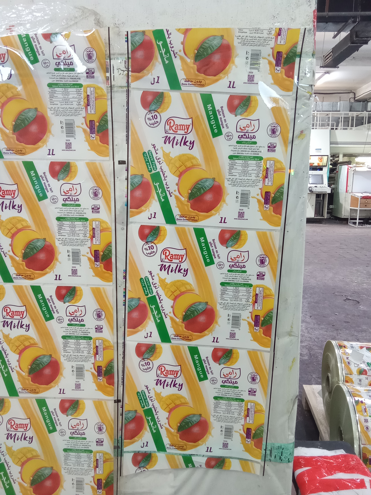
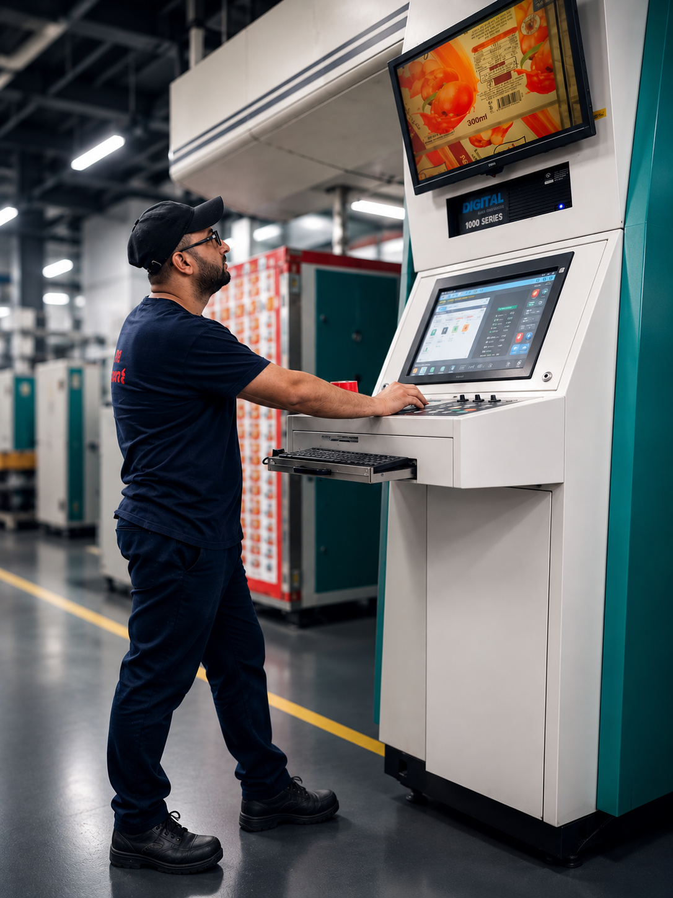
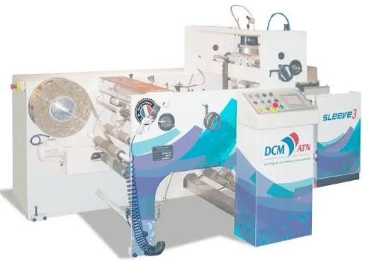
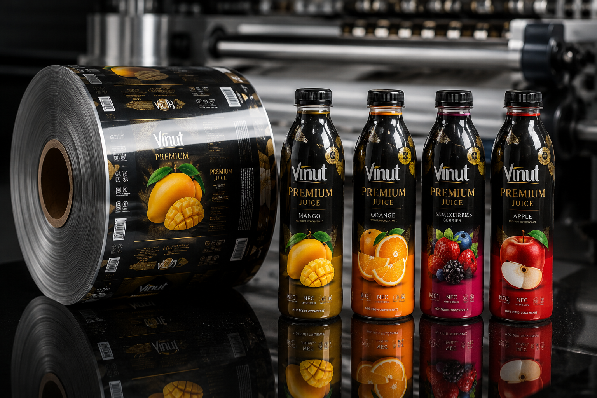

# Ali Bourebaa — Mechanical Engineer | Flexographic Printing & Packaging

## 👋 About Me

Mechanical Engineer specialized in **Materials Engineering**, with professional experience in **flexographic printing, packaging, production and process optimization**.

I have worked on printing and packaging processes involving flexible films and packaging applications, with a strong interest in **process control, quality, troubleshooting, productivity and continuous improvement**.

My objective is to combine engineering knowledge with practical industrial experience to develop reliable and efficient production processes.

---

## 🧑‍🔧 Professional Profile

- **Mechanical Engineer — Materials Engineering**
- **Flexographic Printing Specialist**
- **Production / Process Supervision**
- **Packaging & Flexible Films**
- **Troubleshooting and Process Optimization**
- **Quality Control & Continuous Improvement**
- **Team Leadership / Chef de Groupe**

---

## 🏭 Industrial Experience

### Flexographic Printing

Experience with:

- Flexo UV and CI Flexo printing
- PET, PETG, PVC, BOPP and other flexible substrates
- UV inks and solvent-based processes
- Anilox selection and volume
- Viscosity control
- Corona treatment
- Ink adhesion and drying problems
- Color control and print quality
- Dot gain and registration troubleshooting
- Doctor blades, pumps and ink circulation
- Production monitoring and process optimization

### Shrink Sleeve & Seaming

Experience and technical interest in:

- PETG shrink sleeve films
- Sleeve seaming
- DCM / Sleeve equipment
- Karlville-type sleeve processes
- Solvent selection and process control
- Adhesion and seam quality
- Process parameters and troubleshooting

---

## ⚙️ Machines & Equipment

Professional exposure to equipment and technologies including:

- Flexographic printing machines
- Bobst equipment
- W&H / industrial flexo technologies
- DCM sleeve seaming equipment
- Karlville sleeve systems
- CI Flexo
- UV Flexo
- Anilox systems
- Corona treatment systems
- Inspection and quality-control equipment

> Machine names shown here represent technologies/equipment I have worked with or studied professionally.

---

## 🎨 Selected Work & Applications

### Flexible Packaging & Printed Films

Examples of printed packaging and flexible-film applications.

### Flexographic Printing

Industrial flexographic printing and process control.

### Digital / Printing Control

Operator interface, machine control and production monitoring.

### Sleeve Seaming

Shrink-sleeve processing and seaming technology.

### Finished Printed Products

Examples of finished packaging and printed products.

---

## 📊 Process & Quality

Areas of interest and practical experience:

**Process → Parameters → Control → Quality → Troubleshooting → Continuous Improvement**

Tools and methods:

- 5M
- 5 Why
- PDCA
- 5S
- KPI
- Root Cause Analysis
- Quality inspection
- Process monitoring

---

## 🎓 Education

**Master's Degree — Mechanical Engineering, Materials Engineering**  
Université M'Hamed Bougara — Boumerdès

**Licence — Physics & Materials Mechanics**

---

## 🌍 Languages

- 🇩🇿 Arabic — Native
- 🇫🇷 French — Professional working environment
- 🇬🇧 English — Technical / Professional

---

## 📫 Contact

**Email:** bourbaaali91@gmail.com

**LinkedIn:** https://www.linkedin.com/in/ali-bourebaa-4935a6204

**Facebook:** https://www.facebook.com/share/17vwaszoUR/

---

## 🎯 Career Objective

I am interested in opportunities related to:

**Process Engineering | Production | Flexographic Printing | Packaging | Materials | Quality | Continuous Improvement**

> *Understand the process. Analyze the problem. Act with precision. Improve continuously.*
